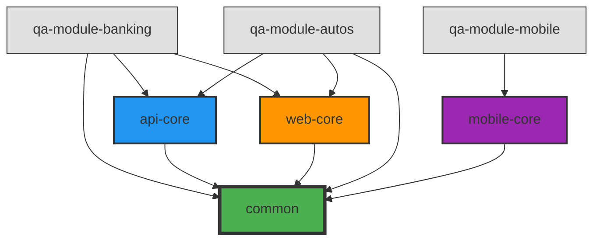

# 🚀 Scotia QA Framework - Guía Completa

Framework de automatización de pruebas modular, extensible y multi-capa para testing de APIs, Web y Mobile.

[](https://openjdk.java.net/)
[](https://gradle.org/)
[](https://cucumber.io/)
[](https://www.selenium.dev/)

---

## 📑 Índice

- [📖 Visión General](#-visión-general)
- [🏗️ Arquitectura](#️-arquitectura)
  - [Diagrama de Repositorios y Capas](#diagrama-de-repositorios-y-capas)
  - [Principios de Diseño](#principios-de-diseño)
  - [Flujo de Dependencias](#flujo-de-dependencias)
- [📦 Capas del Framework](#-capas-del-framework)
  - [Common Layer](#common-layer)
  - [API Core Layer](#api-core-layer)
  - [Web Core Layer](#web-core-layer)
  - [Mobile Core Layer](#mobile-core-layer)
- [🛠️ Stack Tecnológico](#️-stack-tecnológico)
- [🎯 Características Principales](#-características-principales)
- [🔗 Documentación de Capas](#-documentación-de-capas)
- [🤝 Contribución](#-contribución)
  - [Cómo Contribuir](#cómo-contribuir)
  - [Estándares de Código](#estándares-de-código)
  - [Proceso de Revisión](#proceso-de-revisión)
- [📄 Licencia](#-licencia)

---

## 📖 Visión General

El **Scotia QA Framework** es una solución integral para automatización de pruebas que soporta múltiples tipos de testing (API, Web, Mobile) mediante una arquitectura modular y extensible.

### 🎯 Objetivos del Framework

1. **Reutilización**: Componentes genéricos compartidos entre proyectos
2. **Modularidad**: Capas independientes con responsabilidades claras
3. **Extensibilidad**: Fácil agregar nuevas capacidades sin romper existentes
4. **Mantenibilidad**: Código limpio, documentado y testeado
5. **Escalabilidad**: Soporta múltiples módulos y equipos en paralelo

### ✨ Ventajas Clave

- ✅ **Sin Spring Boot** - Liviano y rápido
- ✅ **Type-Safe** - Validaciones en tiempo de compilación
- ✅ **BDD con Cucumber** - Tests legibles para negocio
- ✅ **Multi-capa** - Separación clara de responsabilidades
- ✅ **Multi-repositorio** - Framework + Módulos independientes
- ✅ **CI/CD Ready** - Integración con Jenkins, GitLab, GitHub Actions
- ✅ **Cross-platform** - Compatible con Windows, macOS, Linux

---

## 🏗️ Arquitectura

### Diagrama de Repositorios y Capas

```
┌────────────────────────────────────────────────────────────────────────────────┐
│                          📦 REPOSITORIO DE MÓDULO                               │
│                        (Proyecto de Testing Específico)                        │
│                                                                                │
│                            📁 qa-module-banking                                │
│                                                                                │
│                            - Features (Gherkin)                                │
│                            - Step Definitions                                  │
│                            - Test Data                                         │
│                            - Page Objects                                      │
│                            - Config específica                                 │
│                                                                                │
│                            └─> import framework                                │
└────────────────────────────────────────────────────────────────────────────────┘
                                         │
                                         │ dependencies
                                         ▼
┌────────────────────────────────────────────────────────────────────────────────┐
│                      📦 REPOSITORIO DEL FRAMEWORK                               │
│                         (qa-scotia-frameworks)                                 │
│                                                                                │
│  ┌──────────────────────────────────────────────────────────────────────┐    │
│  │                          CAPA 1: COMMON                               │    │
│  │                     (Componentes Compartidos)                        │    │
│  │                                                                       │    │
│  │  • HTTP Client         • Logging             • ScenarioContext      │    │
│  │  • Validaciones        • Config Management   • Test Data Finder     │    │
│  │  • Database Access     • Utilities           • Hooks & Validators   │    │
│  │  • Exception Handling  • Data Utilities      • Cucumber Integration │    │
│  │                                                                       │    │
│  │  📖 Ver: common/README.md                                            │    │
│  └──────────────────────────────────────────────────────────────────────┘    │
│                                       ▲                                        │
│                                       │ depends on                             │
│  ┌───────────────────┬────────────────┴──────────┬─────────────────────┐    │
│  │                   │                            │                      │    │
│  │  ┌────────────────▼──────┐  ┌────────────────▼──────┐  ┌───────────▼───┐│
│  │  │  CAPA 2: API-CORE     │  │  CAPA 2: WEB-CORE     │  │  CAPA 2:      ││
│  │  │   (API Testing)       │  │   (Web Testing)       │  │  MOBILE-CORE  ││
│  │  │                       │  │                       │  │  (Mobile Test)││
│  │  │  • API Steps          │  │  • Web Steps          │  │  • Mobile     ││
│  │  │  • Request Builders   │  │  • WebDriver Manager  │  │    Steps      ││
│  │  │  • Response Validators│  │  • Page Helpers       │  │  • Appium     ││
│  │  │  • Auth Handlers      │  │  • Element Locators   │  │    Config     ││
│  │  │                       │  │  • Wait Strategies    │  │  • Device     ││
│  │  │ 📖 api-core/README.md │  │                       │  │    Manager    ││
│  │  └───────────────────────┘  │ 📖 web-core/README.md │  │               ││
│  │                              └───────────────────────┘  │ 📖 mobile-    ││
│  │                                                          │    core/      ││
│  │                                                          │    README.md  ││
│  │                                                          └───────────────┘│
│  └──────────────────────────────────────────────────────────────────────────┘│
│                                                                                │
│  ┌──────────────────────────────────────────────────────────────────────┐    │
│  │                    📜 SCRIPTS & UTILIDADES                            │    │
│  │                                                                       │    │
│  │  • test.sh (script de ejecución genérico)                           │    │
│  │  • utils.sh (funciones compartidas)                                 │    │
│  │  • Jenkins integration                                               │    │
│  │                                                                       │    │
│  │  📖 Ver: scripts/README.md                                           │    │
│  └──────────────────────────────────────────────────────────────────────┘    │
└────────────────────────────────────────────────────────────────────────────────┘
```

### Principios de Diseño

El framework sigue estos principios fundamentales:

#### 1. 🎯 **Separación de Responsabilidades**

```
Common Layer    → Funcionalidad compartida (HTTP, DB, Logging, etc.)
Core Layers     → Funcionalidad específica por tipo (API, Web, Mobile)
Modules         → Lógica de negocio y casos de prueba específicos
```

#### 2. 🔗 **Flujo de Dependencias Unidireccional**

```
Módulos  →  Core Layers  →  Common Layer
         (dependen de)  (depende de)

❌ NUNCA: Common → Core
❌ NUNCA: Core → Módulos
❌ NUNCA: Módulo A → Módulo B
```

#### 3. 🧩 **Module-First Pattern**

Los módulos son **proyectos independientes** que:
- Viven en repositorios separados
- Importan el framework como librería (Maven Local o Artifactory)
- Definen su propia configuración (.env, properties)
- Contienen sus propios features, steps específicos y page objects

#### 4. 🎨 **Inversión de Control**

```java
// ✅ BIEN: El framework provee interfaces
public interface DatabaseConnector {
    Connection getConnection();
}

// Los módulos usan sin conocer implementación
DatabaseConnector db = DbConnectorFactory.create(...);
```

#### 5. 🔒 **Encapsulación**

```java
// ✅ BIEN: Lógica interna oculta
public class BaseHttpClient {
    private void sanitizeForLog(String data) { /* privado */ }
    
    public Response post(String url, String body) { /* público */ }
}
```

### Flujo de Dependencias



---

## 📦 Capas del Framework

### Common Layer

**Propósito:** Funcionalidad compartida entre todos los tipos de testing.

**Responsabilidades:**
- 🌐 Cliente HTTP (Unirest wrapper)
- 🗄️ Acceso a base de datos (Oracle, MySQL, PostgreSQL)
- 📝 Sistema de logging estructurado
- ⚙️ Gestión de configuración (properties, .env)
- ✅ Validaciones y assertions
- 🔧 Utilidades de datos (JSON, XML, mapeo)
- 🎭 Contexto de escenarios (compartir datos entre steps)
- 🎣 Hooks de Cucumber condicionales por tags
- 🔍 Test Data Finder (búsqueda de usuarios de prueba en BD)

**Paquetes principales:**
```
com.scotia.qa.common/
├── config/              # Gestión de configuración
├── cucumber/            # Integración con Cucumber
├── database/            # Acceso a BD
├── http/                # Cliente HTTP
├── logging/             # Sistema de logging
└── utils/               # Utilidades generales
```

**📖 Documentación completa:** [common/README.md](common/README.md)

---

### API Core Layer

**Propósito:** Testing de APIs REST/SOAP.

**Responsabilidades:**
- 🔧 Steps de Cucumber para APIs
- 📤 Construcción de requests
- 📥 Validación de responses
- 🔐 Manejo de autenticación
- 📊 Validaciones de schemas
- 🔗 Integración con servicios externos

**Características:**
- Soporte para métodos HTTP (GET, POST, PUT, DELETE, PATCH)
- Validación de status codes
- Validación de headers y body
- Extracción de datos con JsonPath
- Guardado en ScenarioContext para compartir entre steps

**📖 Documentación completa:** [api-core/README.md](api-core/README.md)

---

### Web Core Layer

**Propósito:** Testing de aplicaciones web.

**Responsabilidades:**
- 🖥️ Steps de Cucumber para Web
- 🚗 Gestión de WebDriver (local/remote)
- 📍 Estrategias de locators (Module-First)
- ⏳ Waits inteligentes
- 📸 Capturas de pantalla
- 🎬 Manejo de iframes, alerts, ventanas

**Características:**
- Soporte multi-browser (Chrome, Firefox, Edge)
- Modo headless para CI/CD
- Gestión automática de drivers (WebDriverManager)
- Page Object Pattern
- Componentes reutilizables por módulo

**📖 Documentación completa:** [web-core/README.md](web-core/README.md)

---

### Mobile Core Layer

**Propósito:** Testing de aplicaciones móviles (Android/iOS).

**Responsabilidades:**
- 📱 Steps de Cucumber para Mobile
- 📲 Gestión de Appium
- 🎯 Locators móviles
- ⚙️ Configuración de capabilities
- 📸 Capturas en dispositivos

**Características:**
- Soporte Android e iOS
- Emuladores y dispositivos reales
- Gestos móviles (swipe, scroll, tap)
- Permisos y notificaciones

**📖 Documentación completa:** [mobile-core/README.md](mobile-core/README.md)

---

## 🛠️ Stack Tecnológico

### Dependencias Core

| Tecnología | Versión | Propósito |
|------------|---------|-----------|
| **Java** | 21 (LTS) | Lenguaje base |
| **Gradle** | 8.14 | Build automation |
| **Cucumber** | 7.18.0 | BDD framework |
| **JUnit Platform** | 1.11.3 | Test execution |

### Testing Frameworks

| Librería | Versión | Uso |
|----------|---------|-----|
| **Selenium WebDriver** | 4.27.0 | Web automation |
| **Appium** | 9.1.0 | Mobile automation |
| **Unirest** | 4.4.4 | HTTP client |
| **Rest-Assured** | 5.3.2 | API testing |

### Utilidades

| Librería | Versión | Propósito |
|----------|---------|-----------|
| **Jackson** | 2.18.2 | JSON/XML processing |
| **JsonPath** | 2.9.0 | JSON querying |
| **AssertJ** | 3.24.2 | Fluent assertions |
| **Apache POI** | 5.2.5 | Excel manipulation |

### Database

| Driver | Versión | Base de Datos |
|--------|---------|---------------|
| **Oracle JDBC** | 21.9.0.0 | Oracle Database |
| **MySQL Connector** | 8.0.33 | MySQL |
| **PostgreSQL** | 42.6.0 | PostgreSQL |
| **HikariCP** | 5.0.1 | Connection pooling |

### Logging

| Librería | Versión | Propósito |
|----------|---------|-----------|
| **SLF4J** | 2.0.7 | Logging facade |
| **Logback** | 1.4.11 | Logging implementation |
| **Jansi** | 2.4.0 | Terminal colors |

---

## 🎯 Características Principales

### ✅ Gestión de Configuración

```java
// Lectura desde múltiples fuentes con prioridad
ConfigManager config = ConfigManager.getInstance();
String dbUrl = config.get("db.url");  // .env > properties > System props
```

**Soporta:**
- Archivos `.properties`
- Variables de entorno (`.env`)
- System properties (`-Dkey=value`)
- Configuración por ambiente (qa, uat, prod)

---

### ✅ Contexto de Escenarios (Cross-Layer)

```java
// Guardar datos en un step (API)
ScenarioContext.setByLayer("api", "userId", "12345");

// Recuperar en otro step (Web)
String userId = (String) ScenarioContext.getFromLayer("api", "userId");
```

**Capas soportadas:**
- `api` - Datos de respuestas API
- `web` - Datos de UI
- `mobile` - Datos de app móvil
- `testdata` - Datos de búsqueda en BD
- `shared` - Datos compartidos globalmente

---

### ✅ Hooks Condicionales por Tags

```java
@Before(value = "@api", order = 10)
public void setupApi(Scenario scenario) {
    // Solo se ejecuta si el scenario tiene @api
}

@Before(value = "@web", order = 10)
public void setupWeb(Scenario scenario) {
    // Solo se ejecuta si el scenario tiene @web
}
```

**Tags soportados:**
- `@api` / `@rest` - Tests de API
- `@web` / `@ui` - Tests web
- `@mobile` - Tests móviles
- `@database` / `@db` - Tests con BD

---

### ✅ Test Data Finder

```java
// Buscar usuarios con características específicas
TestUser user = userFinder.findUserWith("tarjeta-credito");

// Auto-guardado en ScenarioContext
String fullName = (String) ScenarioContext.getFromLayer("testdata", "fullName");
```

**Características buscables:**
- Usuarios con cuenta activa/inactiva
- Usuarios con tarjetas de crédito
- Usuarios con préstamos
- Usuarios con productos específicos
- Queries personalizadas en YAML

---

### ✅ Logging Estructurado

```java
TestLogger.logInfo("API_CALL", "Llamando al endpoint /users", 
    Map.of("url", url, "method", "GET"));

// Output:
// INFO [MODULE][SCENARIO][API_CALL] Llamando al endpoint /users
// Context: {url=https://api/users, method=GET}
```

**Niveles:**
- `INFO` - Información general
- `DEBUG` - Debugging detallado
- `WARN` - Advertencias
- `ERROR` - Errores

---

## 🔗 Documentación de Capas

| Capa | Descripción | Documentación |
|------|-------------|---------------|
| **Common** | Funcionalidad compartida | [common/README.md](common/README.md) |
| **API Core** | Testing de APIs | [api-core/README.md](api-core/README.md) |
| **Web Core** | Testing Web | [web-core/README.md](web-core/README.md) |
| **Mobile Core** | Testing Mobile | [mobile-core/README.md](mobile-core/README.md) |
| **Scripts** | Utilidades de ejecución | [scripts/README.md](scripts/README.md) |

### 📘 Guías Adicionales

- **[QUICK-START.md](QUICK-START.md)** - Guía paso a paso para iniciar
- **[TROUBLESHOOTING.md](TROUBLESHOOTING.md)** - Solución de problemas
- **[scripts/jenkins/README.md](scripts/jenkins/README.md)** - Integración con Jenkins

---

## 🤝 Contribución

### Cómo Contribuir

¡Las contribuciones son bienvenidas! Sigue estos pasos:

#### 1. Fork y Clone

```bash
# Fork en GitHub/GitLab
git clone https://github.com/tu-usuario/qa-scotia-frameworks.git
cd qa-scotia-frameworks
```

#### 2. Crear Branch

```bash
# Naming convention: tipo/descripcion-corta
git checkout -b feature/agregar-validacion-xml
git checkout -b fix/corregir-timeout-driver
git checkout -b docs/actualizar-readme-common
```

**Tipos de branch:**
- `feature/` - Nueva funcionalidad
- `fix/` - Corrección de bugs
- `docs/` - Documentación
- `refactor/` - Refactoring (sin cambio funcional)
- `test/` - Agregar o mejorar tests

#### 3. Hacer Cambios

```bash
# Hacer commits atómicos y descriptivos
git add .
git commit -m "feat: agregar validación de schemas XML"
git commit -m "fix: corregir timeout en WebDriver para Chrome"
```

**Formato de commits (Conventional Commits):**
```
<tipo>(<alcance>): <descripción>

[cuerpo opcional]

[footer opcional]
```

**Ejemplos:**
```
feat(api-core): agregar soporte para OAuth2
fix(web-core): corregir locator de botón submit
docs(common): actualizar diagrama de arquitectura
refactor(common): extraer lógica de sanitización a utility
test(api-core): agregar tests unitarios para ResponseValidator
```

#### 4. Ejecutar Tests

```bash
# Ejecutar tests de la capa modificada
./gradlew :common:test
./gradlew :api-core:test
./gradlew :web-core:test

# Ejecutar todos los tests
./gradlew test
```

#### 5. Verificar Estándares

```bash
# Aplicar formato de código
./gradlew spotlessApply

# Verificar que pasa spotless
./gradlew spotlessCheck

# Generar reporte de calidad
./gradlew check
```

#### 6. Push y Pull Request

```bash
git push origin feature/tu-feature

# Crear Pull Request en GitHub/GitLab con:
# - Título descriptivo
# - Descripción de cambios
# - Screenshots si aplica
# - Link a issue relacionado
```

---

### Estándares de Código

#### ✅ Naming Conventions

**Clases:**
```java
// PascalCase
public class BaseHttpClient { }
public class ResponseValidator { }
```

**Métodos:**
```java
// camelCase, verbos descriptivos
public Response executeRequest() { }
public boolean validateStatusCode(int expected) { }
```

**Variables:**
```java
// camelCase, nombres descriptivos
private String baseUrl;
private int connectionTimeout;
```

**Constantes:**
```java
// UPPER_SNAKE_CASE
public static final int DEFAULT_TIMEOUT = 30;
public static final String API_VERSION = "v1";
```

#### ✅ Documentación

**JavaDoc obligatorio para:**
- Clases públicas
- Métodos públicos
- Interfaces

```java
/**
 * Cliente HTTP base para realizar peticiones REST.
 * 
 * <p>Proporciona métodos convenientes para GET, POST, PUT, DELETE
 * con manejo automático de headers, timeouts y logging.
 * 
 * <p><b>Ejemplo de uso:</b>
 * <pre>
 * BaseHttpClient client = new BaseHttpClient();
 * Response response = client.get("https://api.example.com/users");
 * </pre>
 * 
 * @author Abel Venero
 * @since 1.0.0
 */
public class BaseHttpClient {
    /**
     * Ejecuta una petición GET al endpoint especificado.
     * 
     * @param url URL completa del endpoint
     * @return Response con status, headers y body
     * @throws FrameworkTechnicalException si hay error de conexión
     */
    public Response get(String url) {
        // implementación
    }
}
```

#### ✅ Manejo de Excepciones

```java
// ❌ MAL: Tragarse excepciones
try {
    doSomething();
} catch (Exception e) {
    // silencio...
}

// ✅ BIEN: Loguear y relanzar
try {
    doSomething();
} catch (SQLException e) {
    TestLogger.logError("DB_ERROR", "Error ejecutando query", 
        Map.of("query", sql));
    throw new FrameworkTechnicalException("Error en BD", e);
}
```

#### ✅ Logging

```java
// ❌ MAL: System.out
System.out.println("Ejecutando request...");

// ✅ BIEN: TestLogger estructurado
TestLogger.logInfo("HTTP_REQUEST", "Ejecutando petición GET",
    Map.of("url", url, "timeout", timeout));
```

#### ✅ Tests Unitarios

```java
@Test
@DisplayName("Debe validar correctamente un status code 200")
void shouldValidateSuccessStatusCode() {
    // Given
    Response response = createMockResponse(200);
    
    // When
    boolean result = validator.validateStatusCode(response, 200);
    
    // Then
    assertThat(result).isTrue();
}
```

---

### Proceso de Revisión

#### 📋 Checklist del Revisor

- [ ] ✅ El código compila sin errores
- [ ] ✅ Los tests pasan
- [ ] ✅ Spotless aprobado
- [ ] ✅ JavaDoc completo
- [ ] ✅ Sin System.out o printStackTrace
- [ ] ✅ Logging estructurado
- [ ] ✅ Manejo de excepciones apropiado
- [ ] ✅ Nombres descriptivos
- [ ] ✅ Sin lógica de negocio en el framework
- [ ] ✅ Backward compatible (si es posible)

#### 🔍 Áreas de Enfoque

1. **Arquitectura**: ¿Respeta la separación de capas?
2. **Reutilización**: ¿Hay código duplicado que pueda extraerse?
3. **Performance**: ¿Introduce problemas de rendimiento?
4. **Seguridad**: ¿Expone información sensible en logs?
5. **Mantenibilidad**: ¿Es fácil entender y modificar?

#### ⏱️ SLA de Revisión

- **Urgente** (bugs críticos): 24 horas
- **Normal** (features, fixes): 48-72 horas
- **Mejoras** (refactor, docs): 1 semana

---

### 🎖️ Niveles de Contribución

| Nivel | Contribuciones | Reconocimiento |
|-------|---------------|----------------|
| **Contributor** | 1-5 PRs aceptados | Mención en README |
| **Active Contributor** | 6-20 PRs aceptados | Badge en perfil |
| **Core Contributor** | 20+ PRs, revisiones | Acceso de escritura |
| **Maintainer** | Liderazgo técnico | Decisiones de arquitectura |

---

### 📝 Plantilla de Pull Request

```markdown
## Descripción
Breve descripción de qué hace este PR

## Tipo de Cambio
- [ ] 🐛 Bug fix
- [ ] ✨ Nueva feature
- [ ] 📝 Documentación
- [ ] ♻️ Refactoring
- [ ] 🧪 Tests

## Cambios Realizados
- Cambio 1
- Cambio 2

## Testing
- [ ] Tests unitarios agregados/actualizados
- [ ] Tests de integración ejecutados
- [ ] Testing manual realizado

## Screenshots (si aplica)
[Agregar screenshots de cambios visuales]

## Checklist
- [ ] Mi código sigue los estándares del proyecto
- [ ] He revisado mi propio código
- [ ] He agregado JavaDoc donde es necesario
- [ ] Los tests pasan localmente
- [ ] Spotless aprobado
```

---

### 🚫 Qué NO Contribuir

- ❌ Lógica de negocio específica de clientes
- ❌ Credenciales o datos sensibles
- ❌ Dependencias innecesarias
- ❌ Código sin tests
- ❌ Breaking changes sin discusión previa

---

## 📄 Licencia

Scotia QA Framework © 2025  
Todos los derechos reservados.

Este framework es propiedad de Scotiabank y está destinado exclusivamente para uso interno.

**Restricciones:**
- ❌ No distribuir fuera de la organización
- ❌ No usar para proyectos personales
- ✅ Contribuciones internas bienvenidas
- ✅ Compartir entre equipos de QA autorizados

---

## 📞 Contacto y Soporte

- **Documentación**: Ver [QUICK-START.md](QUICK-START.md)
- **Problemas**: Ver [TROUBLESHOOTING.md](TROUBLESHOOTING.md)
- **Contribución**: Ver sección [Contribución](#-contribución)
- **Equipo**: Scotia QA Automation Team

---

**Última actualización**: 28 de Noviembre de 2025  
**Versión del Framework**: 1.0.0  
**Mantenido por**: Abel Venero y Equipo Scotia QA

