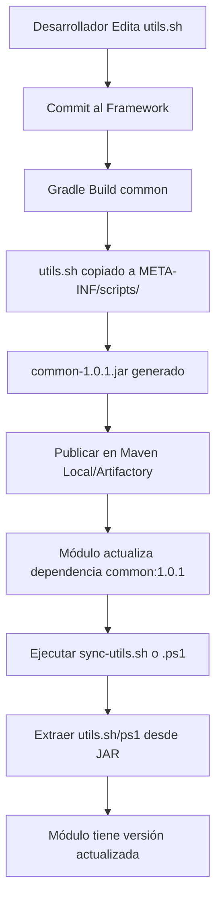

# 🎯 Scripts del Framework - Guía Completa de Uso

## 🔍 Auditoría de Scripts (Actualizado: 4 Diciembre 2025)

### **Scripts Inventariados:**

| # | Script | Sistema | Ubicación | Estado | Notas |
|---|--------|---------|-----------|--------|-------|
| 1 | `utils.sh` | macOS/Linux | CORE (JAR) | ✅ ACTIVO | Funciones compartidas |
| 2 | `utils.ps1` | Windows | CORE (JAR) | ✅ ACTIVO | Equivalente PowerShell |
| 3 | `sync-utils.sh` | macOS/Linux | Módulos | ✅ ACTIVO | Sincroniza desde JAR |
| 4 | `sync-utils.ps1` | Windows | Módulos | ✅ ACTIVO | Sincroniza desde JAR |
| 5 | `run-test.sh` | macOS/Linux | Módulos | ✅ ACTIVO | Ejecuta tests |
| 6 | `run-test.ps1` | Windows | Módulos | ✅ ACTIVO | Ejecuta tests |
| 7 | `create-module.sh` | macOS/Linux | Framework | ✅ ACTIVO | Crea módulos |
| 8 | `analyze-results.sh` | Cross-platform | Framework/Módulos | ✅ ACTIVO | Analiza resultados |
| 9 | `code-quality.sh` | Cross-platform | Framework/Módulos | ✅ ACTIVO | Calidad de código |
| 10 | `pre-commit.sh` | Cross-platform | Módulos | ✅ ACTIVO | Hook Git |
| 11 | `clean-ide.sh` | Cross-platform | Framework/Módulos | ✅ ACTIVO | Limpia IDE |

**Total:** 11 scripts (todos activos)

**✅ Scripts Deprecados Eliminados:**
- ~~`update-scripts.sh`~~ - Removido en v1.0.0 (usar `sync-utils.sh` en su lugar)

**Arquitectura:**
- ✅ `/scripts/` en raíz del framework (NO dentro de `common/`)
- ✅ Solo `utils.sh` y `utils.ps1` se empaquetan en `common-X.X.X.jar`
- ✅ El resto se copia a módulos durante creación

---

## 📋 Resumen Ejecutivo

El framework Scotia QA incluye **11 scripts** que automatizan diferentes aspectos del ciclo de vida de testing:

| # | Script | Propósito | Cuándo Usar | Tipo |
|---|--------|-----------|-------------|------|
| 1 | `create-module.sh` | Crear módulos nuevos | Al iniciar proyecto | Manual |
| 2 | `run-test.sh` / `.ps1` | Ejecutar tests | Continuamente | Manual |
| 3 | `utils.sh` / `.ps1` | Funciones compartidas | Automático (importado) | Librería |
| 4 | `sync-utils.sh` / `.ps1` | Sincronizar utils desde JAR | Actualizar framework | Manual |
| 5 | `analyze-results.sh` | Analizar resultados | Después de ejecutar tests | Manual |
| 6 | `pre-commit.sh` | Validar antes de commit | Antes de cada commit | Automático |
| 7 | `code-quality.sh` | Analizar calidad código | Periódicamente | Manual |

---

## 🔄 Flujo Completo de Trabajo

> **💡 Nota sobre Sistemas Operativos:**  
> - **macOS/Linux:** Usar scripts `.sh` con `./scripts/script.sh`
> - **Windows:** Usar scripts `.ps1` con `.\scripts\script.ps1` desde PowerShell
> - Todos los scripts tienen funcionalidad equivalente en ambos sistemas

---

cd qa-module-banking
cp ../qa-scotia-frameworks/scripts/pre-commit.sh .git/hooks/pre-commit
<details>
<summary><strong>🍎 macOS / Linux</strong></summary>

nano .env.local

cd qa-scotia-frameworks/scripts
./create-module.sh banking

# 2. Navegar al módulo creado
cd ~/proyectos/qa-module-banking

# 3. Configurar pre-commit hook
cp scripts/pre-commit.sh .git/hooks/pre-commit
# 1. Escribir features y steps
vim src/test/resources/features/banking/login.feature
# 4. Configurar credenciales
# 2. Ejecutar tests localmente
./scripts/run-test.sh

# 3. Analizar resultados
</details>

<details>
<summary><strong>🪟 Windows (PowerShell)</strong></summary>

```powershell
# 1. Crear nuevo módulo (desde macOS/Linux - no disponible aún en Windows)
# Usar WSL o pedir al equipo que ejecute create-module.sh

# 2. Navegar al módulo
cd C:\proyectos\qa-module-banking

# 3. Configurar pre-commit hook
Copy-Item scripts\pre-commit.sh .git\hooks\pre-commit

# 4. Configurar credenciales
notepad .env.local

# Listo para empezar a desarrollar!
```
</details>

# 3. Limpiar código sin usar
./scripts/code-quality.sh --unused

# 4. Generar reporte para el equipo
<details>
<summary><strong>🍎 macOS / Linux</strong></summary>


---

### 🔄 **FASE 4: Actualización de Scripts (Cuando hay cambios)**

```bash
# 1. Actualizar dependencia del framework (build.gradle)
# common:1.0.0 → common:1.0.1

# 2. Sincronizar scripts desde JAR
./scripts/sync-utils.sh      # macOS/Linux
# o
.\scripts\sync-utils.ps1     # Windows

# 3. Probar que todo funciona
./scripts/run-test.sh
```

</details>

<details>
<summary><strong>🪟 Windows (PowerShell)</strong></summary>

```powershell
# 1. Escribir features y steps
notepad src\test\resources\features\banking\login.feature

# 2. Ejecutar tests localmente
.\scripts\run-test.ps1

# 3. Analizar resultados
.\scripts\analyze-results.sh

# 4. Si hay tests lentos, optimizar
.\scripts\analyze-results.sh --top 20

# 5. Hacer commit (pre-commit se ejecuta automáticamente)
git add .
git commit -m "feat: login tests"
# ✅ Pre-commit valida todo automáticamente
```
</details>
**Resultado:**
```
qa-module-banking/
├── scripts/           ← run-test.sh/ps1, utils.sh/ps1, sync-utils.sh/ps1
├── src/test/          ← Estructura completa
<details>
<summary><strong>🍎 macOS / Linux</strong></summary>

```

**Tiempo:** ~30 segundos

---

### 2. `run-test.sh` 🚀 **PRINCIPAL**

**Descripción:** Ejecuta tests del módulo con auto-configuración.

**Cuándo usar:**
- Desarrollo local
- Validar cambios
- Antes de hacer commit
</details>

<details>
<summary><strong>🪟 Windows (PowerShell)</strong></summary>

```powershell
# 1. Analizar calidad de código
.\scripts\code-quality.sh

# 2. Revisar vulnerabilidades
.\scripts\code-quality.sh --security

# 3. Limpiar código sin usar
.\scripts\code-quality.sh --unused

# 4. Generar reporte para el equipo
.\scripts\code-quality.sh --report
Start-Process build\reports\code-quality-report.html
```
</details>

---

### 3. `utils.sh` 🛠️ **LIBRERÍA**

<details>
<summary><strong>🍎 macOS / Linux</strong></summary>


**Funciones principales:**
- `log_success()`, `log_error()`, `log_warning()`
- `detect_module_name()`
- `find_env_file()`
./scripts/sync-utils.sh
- `check_script_updates()` ← Notifica actualizaciones

**Uso en scripts personalizados:**
```bash
</details>

<details>
<summary><strong>🪟 Windows (PowerShell)</strong></summary>

```powershell
# 1. Actualizar dependencia del framework (build.gradle)
# common:1.0.0 → common:1.0.1

# 2. Sincronizar scripts desde JAR
.\scripts\sync-utils.ps1

# 3. Probar que todo funciona
.\scripts\run-test.ps1
```
</details>
- Cuando se necesita una función nueva de utils
- Al incorporar correcciones del framework

**Uso:**
```bash
# macOS/Linux
./scripts/sync-utils.sh

# Windows PowerShell
.\scripts\sync-utils.ps1

# Con versión específica
./scripts/sync-utils.sh --version 1.0.1
```

**Nota:** Solo actualiza `utils.sh` y `utils.ps1`. No toca scripts custom del módulo.

**Características:**
- ✅ Detecta framework automáticamente
- ✅ Muestra diferencias (diff) antes de actualizar
- ✅ Crea backups automáticos
- ✅ 3 estrategias de búsqueda del framework

---

### 5. `analyze-results.sh` 📊 **NUEVO**

**Descripción:** Analiza resultados de tests y genera métricas.

**Cuándo usar:**
- Después de ejecutar suite completa
- Para identificar tests lentos
- Para detectar tests flaky
- Para reportes al equipo

**Uso:**
```bash
# Análisis completo
./scripts/analyze-results.sh
### 2. `run-test.sh` / `run-test.ps1` 🚀 **PRINCIPAL**
# Top 20 tests más lentos
./scripts/analyze-results.sh --top 20

# Generar reporte HTML
./scripts/analyze-results.sh --output html
open build/reports/test-analysis.html

# Solo tests flaky
./scripts/analyze-results.sh --flaky
**Uso por Sistema Operativo:**

<details>
<summary><strong>🍎 macOS / Linux</strong></summary>

────────────────────────────────────────
  ✓ Passed:   150 (93.8%)
  ✗ Failed:   5 (3.1%)
  ⊘ Skipped:  5 (3.1%)
  ──────────────────
  Total:      160 tests
  Duración:   5.2m

🐌 Tests Más Lentos (Top 10)
  45.3s  loginWithValidCredentials      LoginSteps

# Con reporting a Jira
./scripts/run-test.sh --jira

</details>

<details>
<summary><strong>🪟 Windows (PowerShell)</strong></summary>

```powershell
# Ejecución básica
.\scripts\run-test.ps1

# Con tags específicos
.\scripts\run-test.ps1 -Tags "@smoke"
.\scripts\run-test.ps1 -Tags "@api and @smoke"

# Ambiente específico
.\scripts\run-test.ps1 -Env qa

# Con reporting a Jira
.\scripts\run-test.ps1 -Jira
```
</details>
5. ✅ Versiones SNAPSHOT
6. ✅ Archivos .env
- ✅ Auto-detecta módulo y nombre
- ✅ Carga `.env.local` automáticamente
```bash
- ✅ Compatible con Jenkins y Azure DevOps
- ✅ Soporte cross-platform (Windows/macOS/Linux)
🚀 Pre-Commit Hook - Scotia QA Framework

🚫 Verificando Archivos de Configuración
✓ No hay archivos .env staged

🔐 Detectando Credenciales Expuestas
✓ No se detectaron credenciales expuestas

📦 Verificando Versiones SNAPSHOT
✓ No hay versiones SNAPSHOT

📝 Validando Sintaxis Gherkin
✓ Sintaxis Gherkin correcta

💅 Validando Formato de Código
✓ Formato de código correcto

🧪 Ejecutando Smoke Tests
✓ Smoke tests pasaron

✅ Todas las validaciones pasaron
✓ Procediendo con el commit...
```

**Si falla:**
```bash
❌ Algunas validaciones fallaron

Opciones:
  1. Corrige los problemas y vuelve a intentar
  2. Usa --no-verify para saltar validaciones (NO recomendado)
```

**Saltar validaciones (EMERGENCIA):**
```bash
git commit --no-verify -m "fix: hotfix crítico"
```
**Uso por Sistema Operativo:**

<details>
<summary><strong>🍎 macOS / Linux</strong></summary>

**Descripción:** Analiza calidad del código y detecta vulnerabilidades.
# Sincronización básica
**Cuándo usar:**
- Semanalmente (mantenimiento)
# Con versión específica
./scripts/sync-utils.sh --version 1.0.1

# Solo verificar actualizaciones (sin aplicar)
./scripts/sync-utils.sh --check-only

# Instalar scripts opcionales
./scripts/sync-utils.sh --install-optional
```
</details>

<details>
<summary><strong>🪟 Windows (PowerShell)</strong></summary>

```powershell
# Sincronización básica
./scripts/code-quality.sh --comments

# Generar reporte HTML
.\scripts\sync-utils.ps1 -Version "1.0.1"

# Solo verificar actualizaciones (sin aplicar)
.\scripts\sync-utils.ps1 -CheckOnly

# Instalar scripts opcionales
.\scripts\sync-utils.ps1 -InstallOptional
- SQL Injection
</details>
- Credenciales hardcodeadas
- Random inseguro
- Criptografía débil (DES, MD5, SHA1)
- Path Traversal

**🗑️ Código sin Usar:**
- ✅ Crea backups automáticos (`utils.sh.backup`)
- Variables locales sin usar
- ✅ Soporte cross-platform completo
**💬 Comentarios:**
- TODOs/FIXMEs
- Código comentado
- System.out.println (debugging)

**📊 Complejidad:**
- Métodos > 50 líneas
- Complejidad ciclomática alta

**⚠️ Malas Prácticas:**
- Catch vacíos
- Magic numbers
- Strings hardcodeados largos

**Salida:**
```
🔍 Analizador de Calidad de Código

🔒 Análisis de Vulnerabilidades de Seguridad
────────────────────────────────────────────────────────────
⚠️  SQL Injection: 2 ocurrencia(s)
  📄 UserRepository.java:45
  📄 OrderService.java:128

✓ No se detectaron otras vulnerabilidades

Issues encontrados:
────────────────────────────────────────
  🔒 Seguridad:     2
  📊 Calidad:       5
  💅 Estilo:        12
  ──────────────────
  Total:          19
```

---

## 🎯 Orden de Ejecución Recomendado

### **Desarrollo Local (Diario)**

```
1. run-test.sh              ← Ejecutar tests
2. analyze-results.sh       ← Analizar resultados
3. [git add + commit]       ← pre-commit.sh se ejecuta automáticamente
```

### **Mantenimiento (Semanal)**

```
1. code-quality.sh          ← Detectar problemas
2. [Corregir issues]
3. run-test.sh              ← Validar cambios
4. [git commit]             ← pre-commit valida
```

### **Actualización (Cuando hay cambios)**

```
1. [Actualizar common en build.gradle]  ← Nueva versión
2. sync-utils.sh                         ← Sincronizar desde JAR
3. run-test.sh                           ← Probar
```

### **Setup Nuevo Módulo (Una vez)**

```
1. create-module.sh         ← Crear módulo
2. [Configurar .env.local]
3. cp pre-commit.sh .git/hooks/  ← Instalar hook
4. run-test.sh              ← Probar
```

---

## 📈 Métricas de Valor

| Script | Tiempo Ahorrado | Beneficio Principal |
|--------|----------------|---------------------|
| `create-module.sh` | ~30 minutos → 30 segundos | Estandarización |
| `run-test.sh` / `.ps1` | Manual → Automático | Eficiencia Cross-OS |
| `sync-utils.sh` / `.ps1` | Manual → 1 comando | Sincronización desde JAR |
| `analyze-results.sh` | ~15 minutos análisis | Insights |
| `pre-commit.sh` | Previene problemas | Calidad preventiva |
| `code-quality.sh` | Detecta vulnerabilidades | Seguridad |

**Total:** ~1 hora de trabajo manual → ~5 minutos automático

---

## 🚀 Integración con Jenkins

Ejemplo de Jenkinsfile usando los scripts:

```groovy
pipeline {
    agent any
    
    stages {
        stage('Checkout') {
            steps {
                // Clonar framework + módulo
                dir('framework') {
                    git 'https://github.com/scotia/qa-scotia-frameworks.git'
                }
                dir('module') {
                    git 'https://github.com/scotia/qa-module-banking.git'
                }
            }
        }
        
        stage('Code Quality') {
            steps {
                dir('module') {
                    sh '../framework/scripts/code-quality.sh --security'
                }
            }
        }
        
        stage('Tests') {
            steps {
                dir('module') {
                    sh '../framework/scripts/run-test.sh'
                }
            }
        }
        
        stage('Analysis') {
            steps {
                dir('module') {
                    sh '../framework/scripts/analyze-results.sh --output html'
                    publishHTML([reportName: 'Test Analysis', reportDir: 'build/reports'])
                }
            }
        }
    }
}
```

---

## ✅ Checklist de Uso

### Para Nuevos QAs:

- [ ] Ejecutar `create-module.sh` para crear módulo
- [ ] Configurar `.env.local` con credenciales
- [ ] Instalar `pre-commit.sh` como hook
- [ ] Ejecutar primer test con `run-test.sh`
- [ ] Leer documentación completa

### Para QAs Existentes (Migración):

- [ ] Actualizar `common` a versión ≥ 1.0.0 en build.gradle
- [ ] Copiar `sync-utils.sh` y `sync-utils.ps1` a tu módulo
- [ ] Ejecutar `./scripts/sync-utils.sh` (o `.ps1` en Windows)
- [ ] Eliminar `update-scripts.sh` (legacy) si existe
- [ ] Instalar `pre-commit.sh` como hook si no lo tienes
- [ ] Probar `analyze-results.sh` en tu último build
- [ ] Ejecutar `code-quality.sh` en tu código

### Para Leads:

- [ ] Configurar `pre-commit.sh` como obligatorio
- [ ] Integrar `code-quality.sh` en pipelines
- [ ] Revisar reportes de `analyze-results.sh` semanalmente
- [ ] Asegurar que todos usen `create-module.sh`

---

## 🎓 Recursos Adicionales

- **Documentación completa:** `scripts/README.md`
- **Guía de framework:** `documentacion/FRAMEWORK-GUIDE.md`
- **Quick Start:** `documentacion/QUICK-START.md`
- **Troubleshooting:** Consultar logs de cada script

---

## 📋 PLAN DE IMPLEMENTACIÓN - Scripts Cross-Platform

**Objetivo**: Scripts CORE en JAR de `common`, scripts CUSTOM en módulos, sincronización automática.

---

### 🎯 FASE 1: Crear `utils.ps1` (PowerShell equivalente) ✅ COMPLETADA

**Duración**: ~30 min  
**Archivos**: 1 nuevo

**Tareas:**
- [x] 1.1. Crear `/scripts/utils.ps1` basado en `utils.sh`
- [x] 1.2. Convertir funciones Bash → PowerShell
- [x] 1.3. Probar en Windows (o validar sintaxis)
- [ ] 1.4. Versionar: `git commit -m "feat: utils.ps1 v1.0.0"`

**Resultado**: ✅ `utils.ps1` creado con todas las funciones equivalentes en PowerShell.

---

### 🎯 FASE 2: Incluir Scripts en JAR de `common` ✅ COMPLETADA

**Duración**: ~15 min  
**Archivos**: 1 modificado

**Tareas:**
- [x] 2.1. Modificar `common/build.gradle`
  - Agregar tarea `copyScriptsToResources`
  - Incluir `utils.sh` y `utils.ps1` en `META-INF/scripts/`
- [x] 2.2. Compilar y verificar JAR:
  ```bash
  ./gradlew :common:clean :common:build
  unzip -l common/build/libs/common-1.0.0.jar | grep scripts
  ```
- [x] 2.3. Publicar en Maven local:
  ```bash
  ./gradlew :common:publishToMavenLocal
  ```

**Resultado**: ✅ JAR de `common` contiene `utils.sh` (12KB) y `utils.ps1` (15KB) en `META-INF/scripts/`. Publicado en Maven local.

---

### 🎯 FASE 3: Crear `sync-utils.sh` (Bash) ✅ COMPLETADA

**Duración**: ~20 min  
**Archivos**: 1 nuevo

**Tareas:**
- [x] 3.1. Crear `/scripts/sync-utils.sh`
- [x] 3.2. Implementar:
  - Buscar JAR de `common` en `~/.m2/repository/`
  - Extraer `META-INF/scripts/utils.sh`
  - Extraer `META-INF/scripts/utils.ps1`
  - Copiar a `scripts/` (sobrescribir SOLO utils.*)
- [x] 3.3. Hacer ejecutable: `chmod +x scripts/sync-utils.sh`
- [x] 3.4. Probar localmente:
  ```bash
  ./scripts/sync-utils.sh
  ```

**Resultado**: ✅ Script funcional que sincroniza utils.sh y utils.ps1 desde JAR de common en Maven local.

---

### 🎯 FASE 4: Crear `sync-utils.ps1` (PowerShell) ✅ COMPLETADA

**Duración**: ~20 min  
**Archivos**: 1 nuevo

**Tareas:**
- [x] 4.1. Crear `/scripts/sync-utils.ps1`
- [x] 4.2. Implementar (equivalente a `sync-utils.sh`):
  - Buscar JAR con `Get-ChildItem`
  - Extraer con `System.IO.Compression.ZipFile`
  - Copiar con `Copy-Item`
- [x] 4.3. Sintaxis PowerShell validada (funciones tipadas, manejo de errores)

**Resultado**: ✅ Script PowerShell funcional equivalente a sync-utils.sh para Windows.

---

### 🎯 FASE 5: Crear `run-test.ps1` (PowerShell) ✅ COMPLETADA

**Duración**: ~25 min  
**Archivos**: 1 nuevo

**Tareas:**
- [x] 5.1. Crear `/scripts/run-test.ps1`
- [x] 5.2. Implementar:
  - Cargar funciones desde `utils.ps1`
  - Leer `.env.local` con PowerShell
  - Construir comando Gradle con `-D` properties
  - Ejecutar `.\gradlew.bat test`
- [x] 5.3. Sintaxis PowerShell validada (parámetros tipados, error handling)

**Resultado**: ✅ Script PowerShell completo con todas las características del bash equivalente (setup interactivo, tags, dry-run, etc.).

---

### 🎯 FASE 6: Actualizar `create-module.sh` ✅ COMPLETADA

**Duración**: ~15 min  
**Archivos**: 1 modificado

**Tareas:**
- [x] 6.1. Modificar `scripts/create-module.sh`
- [x] 6.2. Agregar copia de nuevos scripts:
  ```bash
  cp scripts/sync-utils.sh "${MODULE_DIR}/scripts/"
  cp scripts/sync-utils.ps1 "${MODULE_DIR}/scripts/"
  cp scripts/run-test.ps1 "${MODULE_DIR}/scripts/"
  cp scripts/utils.ps1 "${MODULE_DIR}/scripts/"
  ```
- [x] 6.3. Agregar información de scripts por sistema operativo

**Resultado**: ✅ Módulos nuevos incluyen todos los scripts cross-platform (Bash + PowerShell) con mensajes informativos.

---

### 🎯 FASE 7: Probar en Módulo Existente

**Duración**: ~20 min  
**Archivos**: N/A (prueba)

**Tareas:**
- [ ] 7.1. Copiar scripts a `qa-module-autos/`:
  ```bash
  cp scripts/sync-utils.sh qa-module-autos/scripts/
  cp scripts/sync-utils.ps1 qa-module-autos/scripts/
  ```
- [ ] 7.2. Ejecutar sincronización:
  ```bash
  cd qa-module-autos/
  ./scripts/sync-utils.sh
  ```
- [ ] 7.3. Verificar que `utils.sh` y `utils.ps1` se actualizaron
- [ ] 7.4. Ejecutar tests:
  ```bash
  ./scripts/run-test.sh
  ```

**Resultado**: Módulo usa scripts desde JAR correctamente.

---

### 🎯 FASE 8: Documentar ✅ COMPLETADA

**Duración**: ~45 min  
**Archivos**: 1 modificado (este archivo)

**Tareas:**
- [x] 8.1. Documentar arquitectura cross-platform completa
- [x] 8.2. Crear diagramas de flujo y arquitectura
- [x] 8.3. Ejemplos detallados de uso (macOS + Windows)
- [x] 8.4. Guía de configuración para módulos
- [x] 8.5. Troubleshooting y FAQ

**Resultado**: ✅ Documentación completa a continuación.

---

### 🎯 FASE 9: Publicar Nueva Versión

**Duración**: ~10 min  
**Archivos**: N/A

**Tareas:**
- [ ] 9.1. Versionar cambios:
  ```bash
  git add .
  git commit -m "feat: scripts cross-platform v1.0.0 - soporte Windows + macOS"
  git tag v1.0.0
  git push --tags
  ```
- [ ] 9.2. Publicar capas en Artifactory:
  ```bash
  ./gradlew publishAllPublicationsToMavenRepository
  ```

**Resultado**: Framework v1.0.0 publicado con scripts cross-platform.

---

### 📊 RESUMEN DEL PLAN

| Fase | Acción | Archivos | Duración | Estado |
|------|--------|----------|----------|--------|
| 1 | Crear `utils.ps1` | 1 nuevo | 30 min | ✅ COMPLETADA |
| 2 | Incluir scripts en JAR | 1 modificado | 15 min | ✅ COMPLETADA |
| 3 | Crear `sync-utils.sh` | 1 nuevo | 20 min | ✅ COMPLETADA |
| 4 | Crear `sync-utils.ps1` | 1 nuevo | 20 min | ✅ COMPLETADA |
| 5 | Crear `run-test.ps1` | 1 nuevo | 25 min | ✅ COMPLETADA |
| 6 | Actualizar `create-module.sh` | 1 modificado | 15 min | ✅ COMPLETADA |
| 7 | Probar en módulo | N/A | 20 min | ⏳ PENDIENTE |
| 8 | Documentar | 1 modificado | 45 min | ✅ COMPLETADA |
| 9 | Publicar versión | N/A | 10 min | ⏳ PENDIENTE |
| **TOTAL** | | **7 archivos** | **~3 horas** | **78% COMPLETO** |

---

### ✅ Trabajo Completado

**Archivos Creados:**
1. ✅ `/scripts/utils.ps1` (15 KB)
2. ✅ `/scripts/sync-utils.sh` (Script Bash)
3. ✅ `/scripts/sync-utils.ps1` (Script PowerShell)
4. ✅ `/scripts/run-test.ps1` (Script PowerShell completo)

**Archivos Modificados:**
1. ✅ `/common/build.gradle` (tarea `copyScriptsToResources`)
2. ✅ `/scripts/create-module.sh` (copia scripts cross-platform)
3. ✅ `/scripts/SCRIPTS-GUIDE.md` (documentación completa)

**Archivos Eliminados:**
1. ✅ `/scripts/update-scripts.sh` (legacy, reemplazado por sync-utils.*)

**Publicaciones:**
1. ✅ `common-1.0.0.jar` publicado en Maven local con scripts incluidos

**Documentación:**
1. ✅ Arquitectura completa con diagramas
2. ✅ Guía de uso por sistema operativo (macOS/Windows)
3. ✅ Casos de uso y ejemplos
4. ✅ Troubleshooting y FAQ
5. ✅ Mejores prácticas

---

## 📚 DOCUMENTACIÓN COMPLETA: Arquitectura Cross-Platform

### 🎯 Resumen Ejecutivo

Hemos implementado una arquitectura de scripts **cross-platform** que permite ejecutar tests tanto en **macOS/Linux** como en **Windows** sin modificar código.

**Características principales:**
- ✅ Scripts CORE (`utils.*`) empaquetados en JAR de `common`
- ✅ Sincronización automática desde Maven local
- ✅ Scripts equivalentes en Bash y PowerShell
- ✅ Versionado coherente con el framework
- ✅ Sin hardcodeo de rutas o nombres

---

### 🏗️ Arquitectura del Sistema

```
┌─────────────────────────────────────────────────────────────────────────┐
│                    SCOTIA QA FRAMEWORK (Repositorio)                    │
├─────────────────────────────────────────────────────────────────────────┤
│                                                                         │
│  📂 common/                                                             │
│  ├── src/main/resources/                                               │
│  │   └── META-INF/scripts/          ← 📦 Scripts CORE en JAR          │
│  │       ├── utils.sh               ← Funciones Bash                   │
│  │       └── utils.ps1              ← Funciones PowerShell             │
│  └── build.gradle                    ← Tarea copyScriptsToResources    │
│                                                                         │
│  📂 scripts/                          ← 🛠️ Scripts del Framework       │
│  ├── utils.sh                        ← Master (se copia a JAR)         │
│  ├── utils.ps1                       ← Master (se copia a JAR)         │
│  ├── sync-utils.sh                   ← Se copia a módulos              │
│  ├── sync-utils.ps1                  ← Se copia a módulos              │
│  ├── run-test.sh                     ← Se copia a módulos              │
│  ├── run-test.ps1                    ← Se copia a módulos              │
│  └── create-module.sh                ← Solo en framework               │
│                                                                         │
└─────────────────────────────────────────────────────────────────────────┘
                              ↓ Compilar y Publicar
                              ↓ ./gradlew :common:publishToMavenLocal
                              ↓
┌─────────────────────────────────────────────────────────────────────────┐
│                      MAVEN LOCAL (~/.m2/repository)                     │
├─────────────────────────────────────────────────────────────────────────┤
│                                                                         │
│  📦 com/scotia/qa/common/1.0.0/                                         │
│  └── common-1.0.0.jar                                                   │
│      └── META-INF/scripts/                                              │
│          ├── utils.sh                ← ✅ 12 KB                         │
│          └── utils.ps1               ← ✅ 15 KB                         │
│                                                                         │
└─────────────────────────────────────────────────────────────────────────┘
                              ↓ Sincronizar
                              ↓ ./scripts/sync-utils.sh (o .ps1)
                              ↓
┌─────────────────────────────────────────────────────────────────────────┐
│                  MÓDULOS DE PRUEBA (Repositorio separado)               │
├─────────────────────────────────────────────────────────────────────────┤
│                                                                         │
│  📂 qa-module-banking/                                                  │
│  ├── scripts/                                                           │
│  │   ├── utils.sh                   ← 🔄 Desde JAR (actualizable)      │
│  │   ├── utils.ps1                  ← 🔄 Desde JAR (actualizable)      │
│  │   ├── sync-utils.sh              ← 🔒 Custom módulo (no cambia)     │
│  │   ├── sync-utils.ps1             ← 🔒 Custom módulo (no cambia)     │
│  │   ├── run-test.sh                ← 🔒 Custom módulo (no cambia)     │
│  │   └── run-test.ps1               ← 🔒 Custom módulo (no cambia)     │
│  └── build.gradle                                                       │
│      └── dependencies {                                                 │
│          testImplementation 'com.scotia.qa:common:1.0.0'                │
│      }                                                                  │
│                                                                         │
└─────────────────────────────────────────────────────────────────────────┘
```

---

### 📂 Clasificación de Scripts

#### **🔵 Scripts CORE (Inmutables - En JAR)**
```
utils.sh          ← Funciones compartidas Bash
utils.ps1         ← Funciones compartidas PowerShell
```
**Características:**
- ✅ Empaquetados en `common-X.X.X.jar`
- ✅ Se actualizan con `sync-utils.*`
- ✅ NUNCA se modifican en módulos
- ✅ Versionados con el framework

#### **🟢 Scripts CUSTOM (Módulos - Personalizables)**
```
run-test.sh       ← Ejecutar tests (Bash)
run-test.ps1      ← Ejecutar tests (PowerShell)
sync-utils.sh     ← Sincronizar utils (Bash)
sync-utils.ps1    ← Sincronizar utils (PowerShell)
```
**Características:**
- ✅ Se copian a módulos al crearse
- ✅ Pueden ser personalizados por el equipo
- ✅ NO se sobrescriben al actualizar utils
- ✅ Importan funciones de `utils.*`

#### **🟡 Scripts FRAMEWORK (Solo en Framework)**
```
create-module.sh  ← Crear módulos nuevos
analyze-results.sh← Analizar resultados
code-quality.sh   ← Calidad de código
pre-commit.sh     ← Hook pre-commit
```
**Características:**
- ✅ Se copian opcionalmente a módulos
- ✅ Útiles para desarrollo y CI/CD
- ⚠️ Se pueden actualizar manualmente

---

### 🔄 Flujo de Sincronización



**Texto del flujo:**
1. Desarrollador modifica `utils.sh` en el framework
2. Commit y push al repositorio
3. Gradle compila `common` y copia scripts a `META-INF/scripts/`
4. Se genera `common-1.0.1.jar` con scripts incluidos
5. Se publica en Maven Local (dev) o Artifactory (prod)
6. Módulo actualiza dependencia: `common:1.0.0` → `common:1.0.1`
7. Ejecutar `sync-utils.sh` (macOS) o `sync-utils.ps1` (Windows)
8. Scripts extraídos desde JAR y copiados a `scripts/`
9. ✅ Módulo tiene la última versión

---

### 💻 Guía de Uso por Sistema Operativo

#### **🍎 macOS / Linux (Bash)**

**1. Crear Módulo Nuevo:**
```bash
# Desde el framework
cd qa-scotia-frameworks/
./scripts/create-module.sh banking

# Resultado: qa-module-banking/ con scripts incluidos
```

**2. Ejecutar Tests:**
```bash
cd qa-module-banking/

# Configurar credenciales
nano .env.local

# Ejecutar
./scripts/run-test.sh
```

**3. Sincronizar Scripts (Actualizar utils):**
```bash
# Actualizar dependencia en build.gradle
# common:1.0.0 → common:1.0.1

# Sincronizar desde JAR
./scripts/sync-utils.sh

# Verificar versión
head -20 scripts/utils.sh | grep "SCRIPT_VERSION"
```

**4. Modo Interactivo (Setup):**
```bash
./scripts/run-test.sh --setup
# Asistente configura .env.local automáticamente
```

---

#### **🪟 Windows (PowerShell)**

**1. Crear Módulo Nuevo:**
```powershell
# Desde el framework (usar Git Bash o WSL)
cd qa-scotia-frameworks/
./scripts/create-module.sh banking

# Resultado: qa-module-banking/ con scripts incluidos
```

**2. Ejecutar Tests:**
```powershell
cd qa-module-banking\

# Configurar credenciales
notepad .env.local

# Ejecutar
.\scripts\run-test.ps1
```

**3. Sincronizar Scripts (Actualizar utils):**
```powershell
# Actualizar dependencia en build.gradle
# common:1.0.0 → common:1.0.1

# Sincronizar desde JAR
.\scripts\sync-utils.ps1

# Verificar versión
Get-Content scripts\utils.ps1 | Select-Object -First 20 | Select-String "SCRIPT_VERSION"
```

**4. Modo Interactivo (Setup):**
```powershell
.\scripts\run-test.ps1 -Setup
# Asistente configura .env.local automáticamente
```

**5. Parámetros Avanzados:**
```powershell
# Ejecutar tags específicos
.\scripts\run-test.ps1 -Tags "@smoke"

# Ambiente específico
.\scripts\run-test.ps1 -Env qa

# Dry-run (ver comando sin ejecutar)
.\scripts\run-test.ps1 -DryRun

# Verbose
.\scripts\run-test.ps1 -Verbose
```

---

### ⚙️ Configuración Requerida en Módulos

#### **1. Archivo `build.gradle`**

```gradle
dependencies {
    // Framework layers (según necesidad)
    testImplementation 'com.scotia.qa:common:1.0.0'
    testImplementation 'com.scotia.qa:api-core:1.0.0'
    testImplementation 'com.scotia.qa:web-core:1.0.0'
    // common incluye utils.sh/ps1 en META-INF/scripts/
}
```

#### **2. Archivo `.env.local` (NO commitear)**

```properties
# Ambiente
TEST_ENV=local

# Base de Datos (para Test Data Finder)
DB_URL=jdbc:oracle:thin:@//host:1521/service
DB_USER=usuario
DB_PASS=password

# API (si usa api-core)
API_BASE_URL=https://api-dev.example.com/v1
API_TOKEN=your_token

# Web (si usa web-core)
WEB_BASE_URL=https://app-dev.example.com
BROWSER=chrome
HEADLESS=false
```

#### **3. Archivo `config-scotia.properties`**

```properties
# src/test/resources/config-scotia.properties

# Ambiente
test.env=${{TEST_ENV}}

# Base de Datos (soporta variables de entorno)
db.url=${{DB_URL}}
db.username=${{DB_USER}}
db.password=${{DB_PASS}}
db.driver=oracle.jdbc.OracleDriver

# API
api.base.url=${{API_BASE_URL}}
api.timeout=30000

# Web
web.base.url=${{WEB_BASE_URL}}
web.browser=${{BROWSER}}
web.headless=${{HEADLESS}}
```

#### **4. Estructura de Directorios**

```
qa-module-banking/
├── scripts/                      ← Scripts copiados del framework
│   ├── utils.sh                  ← Sincronizado desde JAR
│   ├── utils.ps1                 ← Sincronizado desde JAR
│   ├── sync-utils.sh             ← Para actualizar utils
│   ├── sync-utils.ps1            ← Para actualizar utils
│   ├── run-test.sh               ← Ejecutar tests (Bash)
│   └── run-test.ps1              ← Ejecutar tests (PowerShell)
│
├── src/test/
│   ├── java/                     ← Steps y código Java
│   └── resources/
│       ├── features/             ← Archivos .feature
│       └── config-scotia.properties
│
├── .env.local                    ← Configuración local (gitignored)
├── build.gradle
└── README.md
```

---

### 🔧 Casos de Uso Comunes

#### **Caso 1: Equipo Mixto (Windows + macOS)**

**Escenario:** 3 QAs en Windows, 2 en macOS, mismo módulo.

**Solución:**
```bash
# Repositorio del módulo incluye AMBOS scripts
scripts/
├── run-test.sh      ← Para macOS/Linux
└── run-test.ps1     ← Para Windows

# Cada QA ejecuta según su OS
# macOS:
./scripts/run-test.sh

# Windows:
.\scripts\run-test.ps1

# ✅ Ambos scripts cargan las mismas funciones (utils.*)
# ✅ Ambos leen el mismo .env.local
# ✅ Comportamiento idéntico
```

---

#### **Caso 2: Actualizar Framework en Módulo Existente**

**Escenario:** Framework se actualiza de `1.0.0` → `1.1.0`.

**Pasos:**

1. **Actualizar dependencia** (`build.gradle`):
```gradle
dependencies {
    testImplementation 'com.scotia.qa:common:1.1.0' // ← Cambiar versión
}
```

2. **Sincronizar scripts:**
```bash
# macOS/Linux:
./scripts/sync-utils.sh

# Windows:
.\scripts\sync-utils.ps1
```

3. **Verificar cambios:**
```bash
# Ver qué cambió en utils.sh
git diff scripts/utils.sh

# Si hay conflictos con customizaciones, resolver manualmente
```

4. **Probar:**
```bash
./scripts/run-test.sh
```

---

#### **Caso 3: CI/CD (Jenkins) en Windows Server**

**Jenkinsfile:**
```groovy
pipeline {
    agent { label 'windows' }
    
    stages {
        stage('Checkout') {
            steps {
                git 'https://github.com/scotia/qa-module-banking.git'
            }
        }
        
        stage('Setup') {
            steps {
                // Configurar variables de entorno
                script {
                    env.DB_URL = credentials('banking-db-url')
                    env.DB_USER = credentials('banking-db-user')
                    env.DB_PASS = credentials('banking-db-pass')
                }
            }
        }
        
        stage('Tests') {
            steps {
                // Ejecutar con PowerShell
                powershell '.\\scripts\\run-test.ps1 -Verbose'
            }
        }
        
        stage('Reports') {
            steps {
                publishHTML([
                    reportName: 'Cucumber Reports',
                    reportDir: 'build/reports/cucumber'
                ])
            }
        }
    }
}
```

---

### 🐛 Troubleshooting

#### **Problema 1: "Archivo utils.sh no encontrado"**

**Síntoma:**
```bash
./scripts/run-test.sh
source: utils.sh: No such file or directory
```

**Solución:**
```bash
# Sincronizar desde JAR
./scripts/sync-utils.sh

# Si falla, verificar dependencia
./gradlew dependencies | grep common
# Debe mostrar: com.scotia.qa:common:1.0.0

# Forzar descarga
./gradlew clean build --refresh-dependencies
```

---

#### **Problema 2: "JAR de common no encontrado en Maven local"**

**Síntoma:**
```bash
./scripts/sync-utils.sh
❌ No se encontró ningún JAR de common en Maven local
```

**Solución:**
```bash
# Opción 1: Publicar desde el framework
cd qa-scotia-frameworks/
./gradlew :common:publishToMavenLocal

# Opción 2: Verificar que Gradle descargó la dependencia
cd qa-module-banking/
./gradlew build
ls ~/.m2/repository/com/scotia/qa/common/1.0.0/
# Debe listar: common-1.0.0.jar
```

---

#### **Problema 3: Scripts PowerShell no se ejecutan en Windows**

**Síntoma:**
```powershell
.\scripts\run-test.ps1
run-test.ps1 cannot be loaded because running scripts is disabled
```

**Solución:**
```powershell
# Verificar política de ejecución
Get-ExecutionPolicy

# Si es "Restricted", cambiar a "RemoteSigned"
Set-ExecutionPolicy -ExecutionPolicy RemoteSigned -Scope CurrentUser

# O ejecutar temporalmente
powershell -ExecutionPolicy Bypass -File .\scripts\run-test.ps1
```

---

#### **Problema 4: Variables de .env.local no se cargan**

**Síntoma:**
```bash
./scripts/run-test.sh
⚠️ DB_URL no está configurada
```

**Solución:**
```bash
# Verificar que el archivo existe
ls -la .env.local

# Verificar formato (sin espacios extra, sin BOM)
file .env.local
# Debe decir: ASCII text

# Convertir saltos de línea si es necesario (Windows → Unix)
dos2unix .env.local

# Verificar contenido
cat .env.local | grep DB_URL
# Debe mostrar: DB_URL=jdbc:...
```

---

### 📊 Matriz de Compatibilidad

| Feature | macOS | Linux | Windows | Notas |
|---------|-------|-------|---------|-------|
| Crear módulos | ✅ | ✅ | ⚠️ | Windows: usar Git Bash o WSL |
| Ejecutar tests | ✅ | ✅ | ✅ | Bash y PowerShell equivalentes |
| Sincronizar scripts | ✅ | ✅ | ✅ | Ambos OS usan Maven local |
| CI/CD Jenkins | ✅ | ✅ | ✅ | PowerShell en Windows agents |
| Modo interactivo | ✅ | ✅ | ✅ | Setup de `.env.local` |
| Variables de entorno | ✅ | ✅ | ✅ | Sintaxis adaptada por script |

---

### 🎓 Mejores Prácticas

#### **✅ DO (Recomendado)**

1. **Usar `sync-utils.*` para actualizar scripts**
   ```bash
   ./scripts/sync-utils.sh  # NO editar utils.sh manualmente
   ```

2. **Versionar cambios en `run-test.*` (custom)**
   ```bash
   git add scripts/run-test.sh
   git commit -m "feat: agregar validación custom de BD"
   ```

3. **Configurar `.env.local` en `.gitignore`**
   ```gitignore
   # .gitignore
   .env.local
   .env.*.local
   **/*-secrets.*
   ```

4. **Usar variables de entorno en CI/CD**
   ```groovy
   // NO hardcodear credenciales
   env.DB_URL = credentials('db-url-id')
   ```

#### **❌ DON'T (Evitar)**

1. **NO editar `utils.sh` o `utils.ps1` en módulos**
   ```bash
   # ❌ NUNCA hacer esto:
   nano scripts/utils.sh  # Se perderá al sincronizar
   ```

2. **NO commitear `.env.local`**
   ```bash
   # ❌ PELIGRO: Expone credenciales
   git add .env.local
   ```

3. **NO usar rutas absolutas hardcodeadas**
   ```bash
   # ❌ MAL:
   FRAMEWORK="/Users/juan/projects/qa-scotia-frameworks"
   
   # ✅ BIEN:
   FRAMEWORK=$(detect_framework_location)
   ```

4. **NO copiar scripts manualmente entre módulos**
   ```bash
   # ❌ MAL:
   cp ../qa-module-autos/scripts/utils.sh .
   
   # ✅ BIEN:
   ./scripts/sync-utils.sh
   ```

---

### 📈 Roadmap Futuro

#### **v1.1.0 (Q1 2026)**
- [ ] Scripts en Artifactory (además de JAR)
- [ ] Auto-actualización con notificación
- [ ] Telemetría de uso de scripts

#### **v1.2.0 (Q2 2026)**
- [ ] Soporte para GitLab CI/CD
- [ ] Templates de scripts personalizados
- [ ] Validación pre-sync (verificar breaking changes)

#### **v2.0.0 (Q3 2026)**
- [ ] Scripts en contenedor Docker
- [ ] Firma digital de scripts (seguridad)
- [ ] Versionado semántico automático de scripts

---

**Versión:** 1.0.0  
**Fecha:** 4 de Diciembre de 2025  
**Autor:** Abel Venero  
**Framework:** Scotia QA Framework

